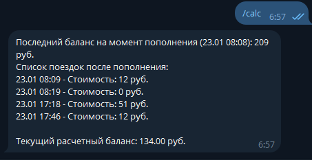
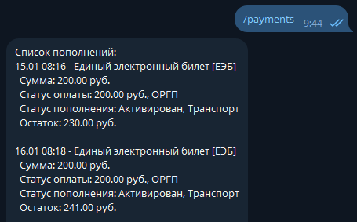
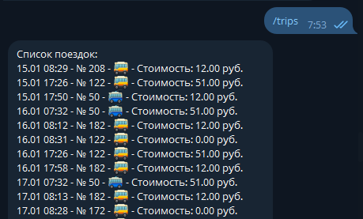

# Telegram Bot для Подорожник

Этот репозиторий содержит Telegram-бота на PHP, разработанного для взаимодействия с системой транспортных карт Подорожник. Бот позволяет получать данные транспортной карты, просматривать историю поездок и отслеживать платежи с помощью простых команд в Telegram. Попробуйте бота в действии по адресу: https://t.me/P0d0r0zhnik_Bot
Для работы требуется зарегистрироваться на сайте: https://podorozhnik.spb.ru/auth/signup или в приложении (https://www.rustore.ru/catalog/app/com.orgp.podorozhnik) и добавить свою карту Подорожник.

## Возможности

- **Авторизация и управление токенами:**

  - Поддерживает авторизацию с использованием предоставленных пользователем учетных данных (email и пароль).
  - Не сохраняет логин и пароль на сервере.
  - Сохраняет и обновляет токены для удобства пользователей.

- **История поездок и платежей:**

  - Получает и отображает историю поездок с подробной информацией (дата, маршрут, тип и стоимость).
  - Получает историю платежей с деталями о сумме, статусе и остатке на счете.

- **Расчет баланса:**

  - Рассчитывает текущий баланс на основе данных о поездках и платежах.

## Требования

- PHP 7.4 или выше
- Composer (для управления зависимостями)
- Токен Telegram Bot API

## Установка

1. Клонируйте этот репозиторий:

   ```bash
   git clone https://github.com/shlyahten/podorozhnik.git
   cd podorozhnik
   ```

2. Установите зависимости:

   ```bash
   composer install
   ```

3. Укажите токен вашего Telegram-бота:

   ```php
   $botToken = '<TELEGRAM BOT TOKEN>';
   ```

4. Настройте вебхук для вашего Telegram-бота:
   ```bash
   https://api.telegram.org/bot{bot_token}/setWebhook?url={url_to_main.php}
   ```

## Команды

### Пользовательские команды

- **Авторизация:**
  Отправьте свои учетные данные в формате `email:password` для входа в систему (от личного кабинета).

- **Обновление токена:**
  Используйте команду `/refresh` для обновления токена (срок жизни токена 5 минут).

- **История поездок:**
  Используйте команду `/trips` для получения и отображения истории поездок (Рекомендуется выполнять `/refresh` перед запросом. Данные могут обновляться с задержкой это не зависит от бота.).

- **История платежей:**
  Используйте команду `/payments` для получения и отображения истории платежей (Используется токен подорожника, время жизни около месяца. Пока не научился его обновлять, можно пройти авторизацию повторно если возникают ошибки.).

- **Расчет баланса:**
  Используйте команду `/calc` для расчета текущего баланса (берутся за основу данные `/trips` и `/payments`).

## Структура файлов

- `main.php`: Основная логика бота.

- `db.txt`: Хранит токены пользователей для системы ВПБ (с привязкой к chat id).

- `p_db.txt`: Хранит токены пользователей для системы Подорожник (с привязкой к chat id).

## Примеры работы

### Расчет остатка баланса


### Список пополнений


### Список поездок


## TODO

1. Добавить возможность обновления данных через cron.
2. Добавить поддержку нескольких транспортных карт.
3. Добавить автоматическое обновление токенов.
4. Добавить счетчик пересадочного тарифа.

## Участие в разработке

Мы приветствуем вклад в развитие проекта! Пожалуйста, форкните этот репозиторий и отправьте pull request с вашими улучшениями.

## Лицензия

Этот проект распространяется по лицензии MIT. Подробности смотрите в файле LICENSE.

---

Для дополнительной информации свяжитесь с владельцем репозитория или создайте issue в этом репозитории.

